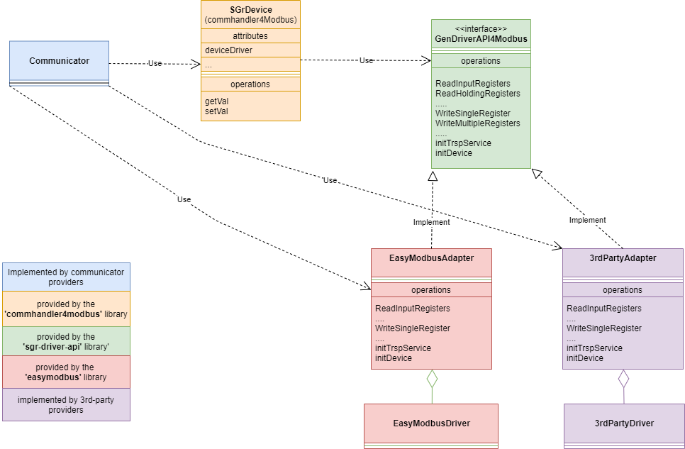

# 

### Generic Device Driver API

The Generic Device Driver API makes the SGr communication handler (CommHandler4Modbus) independent from the device driver implementation. The communication handler can uses the same interface to communicate with any modbus driver (EasyModbus, 3rdPartyDriver).

#### Component: Communicator
<table valign="top">
    <tr><td><b>Implementor:</b></td><td>Communicator provider</td></tr>
    <tr><td><b>Description:</b></td><td>Device that controls 
    <tr><td valign="top"><b>Responsibilities:</b></td><td>
                
Instantiates concrete device adapter  (EasyModbusAdapter, 3rdPartyDriverAdapter...)

                
Instantiates SGrDevice (provided by the <b>commhandler4Modbus</b> library)

                
Uses the <b>commhandler4Modbus</b> library to send commands to the device (readVal(), getVal())
 </td></tr>
    <tr><td><b>Library:</b></td><td>n.a</td></tr>                                                                                          
    <tr><td><b>SGrProject:</b></td><td><a href="https://github.com/SmartgridReady/SGrJavaSamples/tree/master/SampleCommunicator">SGrJavaSamples/SampleCommunicator<a></td></tr>                                                                                                                                                                                                                     
</table>  

##### Component: SGrDevice
<table valign="top">
    <tr><td><b>Implementor:</b></td><td>SGr core development teamr</td></tr>
    <tr><td valign="top"><b>Responsibilities:</b></td><td>
                
P

                
Instantiates SGrDevice (provided by the <b>commhandler4Modbus</b> library)

                
Uses the <b>commhandler4Modbus</b> library to send commands to the device (readVal(), getVal())
 </td></tr>
    <tr><td><b>Library:</b></td><td>n.a</td></tr>                                                                                          
    <tr><td><b>SGrProject:</b></td><td><a href="https://github.com/SmartgridReady/SGrJavaSamples/tree/master/SampleCommunicator">SGrJavaSamples/SampleCommunicator<a></td></tr>                                                                                                                                                                                                                     
</table> 

##### Component: SGrGenDriverAPI4Modbus
- Defined by the the SGr core developer team
- Implemented by SGr core team (EasyModbus adapter) or any 3rdParty device driver providers
- Used by the SGrDevice to communicate with any modbus driver

