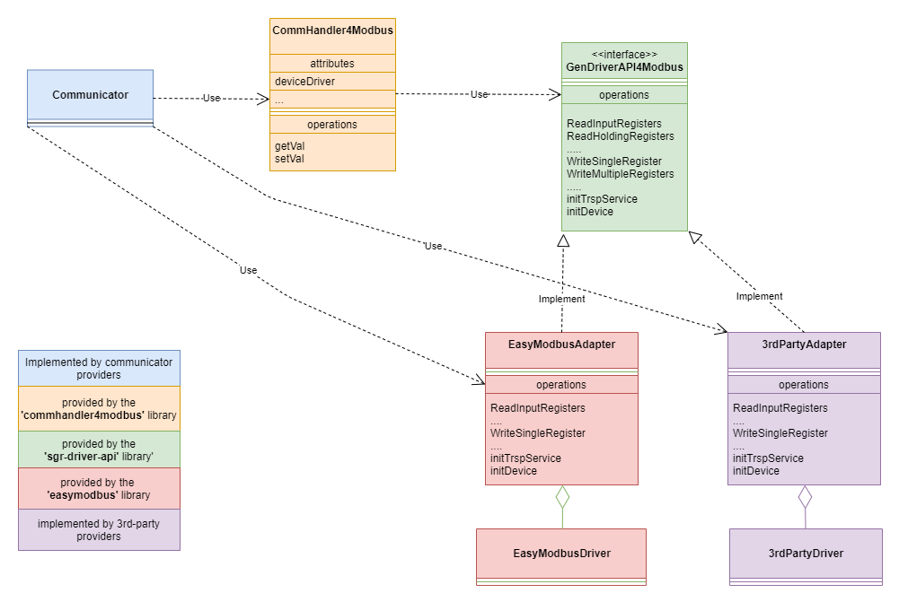

# SGrJavaDrivers

## Index
[Summary](#summary)<br>
[Project setup for developers](#project-setup)<br>
[Build and publish for development](#build-and-publish-for-development)<br>
[Build and publish a release](#build-and-publish-a-release)<br>

## Summary

SGrJavaDrivers contains libraries  that adapt the commhandler's generic device interface to device specific (communications-) transport layer.

List of current library projects:
- <b>SGrGenDriverAPI4Modbus</b>: Provides the generic driver API definitions for Modbus (as used by the SGr communication handler).
- <b>EasyModbus</b>: Consists of the Modbus driver provideded by 'Copyright (c) 2018-2020 Rossmann-Engineering' together with the SGr generic driver API adapters for ModbusRTU and ModbusTCP.

The chapters following chapters describe the architecture of the device adapters in detail.
To support their own Modbus drivers within SmartgridReady, third party providers can implement their own adapters that implement the SGrGenDriverAPI4Modbus interface.

## Generic Device Driver API

The Generic Device Driver API makes the SGr communication handler (CommHandler4Modbus) independent from the device driver implementation. The communication handler uses the same interface to communicate with any modbus driver (EasyModbus, 3rdPartyDriver).




### Component: Communicator
<table valign="top">
    <tr><td>Implementor:</td><td>Communicator provider</td></tr>
    <tr><td>Description:</td><td>The Communicator is a SGr compliant controlling device that uses the SGr Generic Interface to send commands to any device/product in the SGr environment.</tr></td>
    <tr><td valign="top">Responsibilities:</td><td>
                <p>Instantiates a concrete device driver adapter  (EasyModbusAdapter, 3rdPartyDriverAdapter...)</p>
                <p>Creates a Commhandler4Modbus instance (provided by the <b>commhandler4Modbus</b> library)</p>
                <p>Uses the CommHandler4Modbus instance to send commands to the device (readVal(), getVal())</p> </td></tr>
    <tr><td>Library:</td><td>n.a.</td></tr>                                                                                          
    <tr><td>SGrProject:</td><td><a href="https://github.com/SmartgridReady/SGrJavaSamples/tree/master/SampleCommunicator">SGrJavaSamples/SampleCommunicator<a></td></tr>                                                                                                                                                                                                                     
</table>  

<br><br>

### Component: CommHandler4Modbus
<table valign="top">
    <tr><td>Implementor:</td><td>SGr core development team</td></tr>
    <tr><td>Description:</td><td>SGr core component that maps SGr Generic Interface commands to commands of a specific product/device (External Interface), based on a device description provided in XML.
    <tr><td valign="top">Responsibilities:</td><td>
                <p>Provides the SGr Generic Interface to read and set values on the external product/device getVal(), setVal()...</p>
                <p>Converts the Generic Interface commands to device specific commands.</p>
                <p>Uses the generic interface GenDriverAPI4Modbus to send commands to the product/device</p> </td></tr>
    <tr><td>Library:</td><td><b>commmHandler4modbus.jar</b>
        <p>includes:</p>
            <ul><li>sgr-driver-api.jar</li><li>easymodbus.jar</li>
        </td></tr>                                                                                          
    <tr><td>SGrProject:</td><td><a href="https://github.com/SmartgridReady/SGrJava/tree/master/InterfaceFactory/CommHandler4Modbus">SGrJava/InterfaceFactory/CommHandler4Modbus<a></td></tr>    
</table> 

<br><br>

### Component: SGrGenDriverAPI4Modbus
<table valign="top">
    <tr><td>Implementor:</td><td>SGr core development team</td></tr>
    <tr><td>Description:</td><td><p>Defines the Java interface that must be implemented by any SGr compliant modbus device driver or driver adapter.</p>
     <p>This interface must be implemented by any modbus device SGr compliant modbus device driver.</p>
    <tr><td valign="top">Responsibilities:</td><td>
                <p>Definition of the generic device driver API used by the SGrDevice component to send commands to the products.</p>               
                </td></tr>
    <tr><td>Library:</td><td><b>sgr-driver-api.jar<b></td></tr>                                                                                          
    <tr><td>SGrProject:</td><td><a href="https://github.com/SmartgridReady/SGrJavaDrivers/tree/master/GenDriverAPI">SGrJavaDrivers/GenDriverAPI<a></td></tr>    
</table>

<br><br>

### Component: EasyModbusAdapter
<table valign="top">
    <tr><td>Implementor:</td><td>SGr core development team</td></tr>
    <tr><td>Description:</ts><td>Adapts the generic device driver API to the EasyModbus device driver.</td></tr>
    <tr><td valign="top">Responsibilities:</td><td>
                <p>Maps SGrGenDriverAPI4Modbus commands to EasyModbus commands.</p>
                <p>Maps EasyModbus specific exceptions to SGrGenDriverAPI4Modbus exceptions.</p>
                </td></tr>
    <tr><td>Library:</td><td><b>sgr-driver-api.jar<b></td></tr>                                                                                          
    <tr><td>SGrProject:</td><td><a href="https://github.com/SmartgridReady/SGrJavaDrivers/tree/master/EasyModbus">SGrJavaDrivers/EasyModbus<a></td></tr>    
</table> 

<br><br>

### Component: EasyModbus
<table valign="top">
    <tr><td>Implementor:</td><td>SGr core development team</td></tr>
    <tr><td>Description:</ts><td>Modbus device driver provided by the SGr core development team.</td></tr>
    <tr><td valign="top">Responsibilities:</td><td>
                <p>Implements a modbus device driver that supports modbus RTU and modbus overTCP</p>
                </td></tr>
    <tr><td>Library:</td><td><b>easymodbus.jar<b></td></tr>                                                                                          
    <tr><td>SGrProject:</td><td><a href="https://github.com/SmartgridReady/SGrJavaDrivers/tree/master/EasyModbus">SGrJavaDrivers/EasyModbus<a></td></tr>    
</table>

<br><br>

### Component: 3rdPartyAdapter
<table valign="top">
    <tr><td>Implementor:</td><td>3rd party provider</td></tr>
    <tr><td>Description:</ts><td>Adapts the generic device driver API to the 3rd party device driver.</td></tr>
    <tr><td valign="top">Responsibilities:</td><td>
       <p>Maps SGrGenDriverAPI4Modbus commands to 3rd party driver commands</p>
        <p>Maps 3rd party driver specific exceptions to 3rd party driver exceptions.</p>
        </td></tr>
</table>

### Component: 3rdPartyDriver
<table valign="top">
    <tr><td>Implementor:</td><td>3rd party provider</td></tr>
    <tr><td>Description:</ts><td>Proprietary Modbus driver provided by a 3rd party.</td></tr>
    <tr><td valign="top">Responsibilities:</td><td>        
       <p>Implements a 3rd party modbus driver</p>
       <p>Receive commands from the 3rdPartyAdapter.</p>
    </td></tr>
</table>


## Project Setup

### Prerquisites
- Gradle version >= 7.3.3. Note: If no IDE with Gradle integration is used, Gradle must first be installed locally: https://gradle.org/install/
- Java JDK version >= Java 1.8

### Clone from GitHub
- Clone this repo to your local machine: https://github.com/SmartgridReady/SGrJavaDrivers.git

## Build and publish for development
- Change to the local ```{project-root}/SGrJavaDrivers/GenDriverAPI``` directory.
- Run the command:
    ```
    bash>gradle publishToMavenLocal
    ```
- Change to the local ```{project-root}/SGrJavaDrivers/EasyModbus``` dirctory.
- Run the command:
    ```
    bash>gradle publishToMavenLocal
    ```
<p>When using an IDE (Intellij/Eclipse...) you can also use the IDE's Gradle integration to run 'publishToMavenLocal'. </p>

<p>The steps above will compile, build the library jar's and publish the libraries to the local Maven repository. 
<p><b>Rem:</b>The libraries are the most current and used for SGr core development such as the communication handler ( see https://github.com/SmartgridReady/SGrJava ).


## Build and publish a release
- Change to the local ```{project-root}/SGrJavaDrivers/GenDriverAPI``` directory.
- Check that the ```build.gradle``` file has the correct version number for the ```sgr-driver-api.jar``` file:
    ```
    publishing {
        publications {
            api(MavenPublication) {
                groupId = 'ch.smartgridready'
                artifactId = 'sgr-driver-api'
                version = '<correct-version>'

                from components.java        
            }
        }
    }
    ```
- Run the command:
    ```
    bash>gradle publishAllPublicationsToGitHubRepository
    ```
- Change to the local ```{project-root}/SGrJavaDrivers/EasyModbus``` dirctory.
- Check that the ```build.gradle``` file has the correct version number for the 
    ```easy-modbus. jar``` file:
    ```
    publishing {
        publications {
            maven(MavenPublication) {
                groupId = 'ch.smartgridready'
                artifactId = 'easymodbus'
                version = '<correct-version>'

                from components.java
            }
        }
    }
    ```

- Run the command:
    ```
    bash>gradle publishAllPublicationsToGitHubRepository
    ```

<p>The steps above will compile, build the library jar's and publish the libraries to the  Maven repository on GitHub. The libaries are now published on GitHub, therefore public and can be used by integrators of SGr communicators.</p> 

<p><b>Rem:</b> The SGr starter projects/code samples use the driver libraries from GitHub (see: https://github.com/SmartgridReady/SGrJavaSamples)


